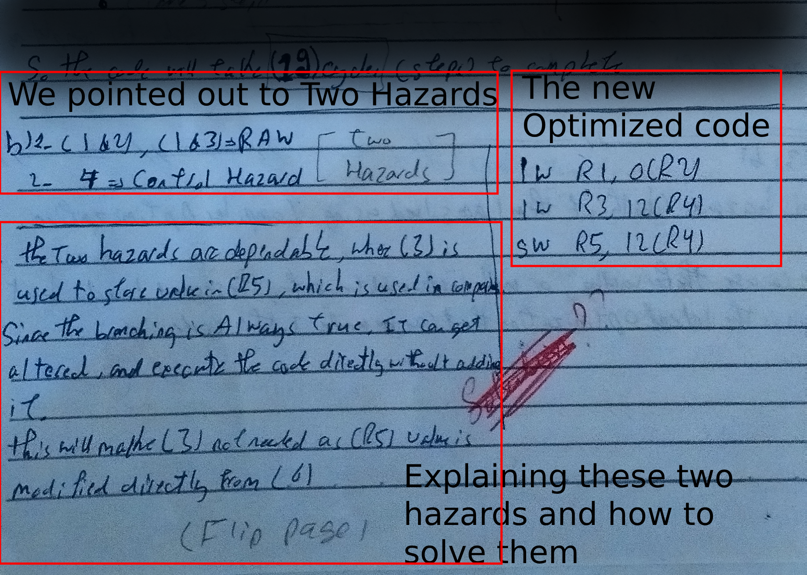
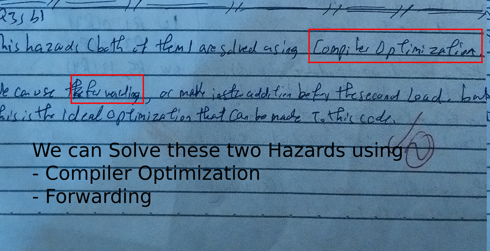
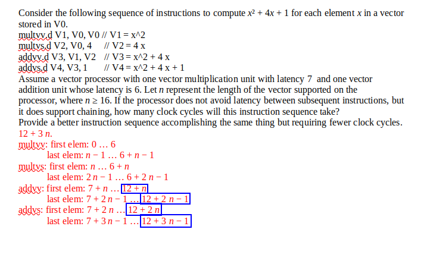
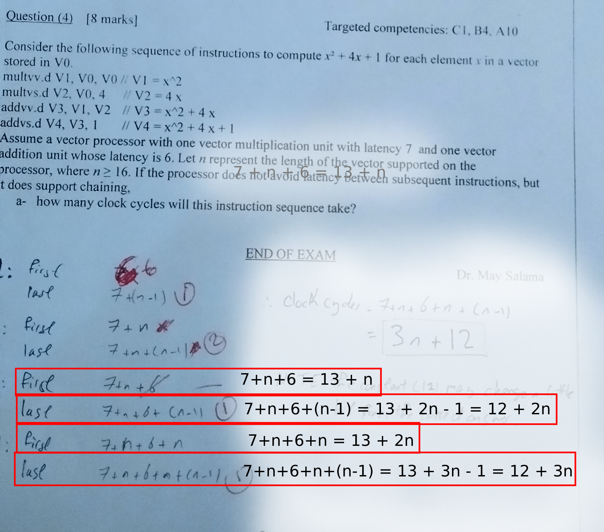

First of all, Thanks A lot `Doctor May` for Opening a way to Dispute Exam Marks. I will try to show my thoughts as clearly as I can. and I am OK with the final result whatever it is. 

## Question (3) A)

According to the Answer:

Here is the ending of Instruction:
- `1` => 5
- `2` => 6
- `3` => 10
- `4` => 14
- `5` => 17

And our Answer for the instructions Endings was the same for the first 4 but we failed to get the Fifth one correct. It can be seen clear from the Image down below the ending time of the Instructions.

### Instruction 3 marked as Wrong

- Instruction 3 marked as wrong in the paper, and the Doctor puts it at `11` position. But it should be 10 as We put before.

### Staling before Decoding

- I do not know why the Answer stale `Instruction 3` before decoding. How the processor knows the Registers that will be used and data locations before decoding instruction. We made the Stale occuar when `instruction 3` goes to Decode, where the proccessor knows there is Data depency and stale it. I disagee with this point.

### Instruction 5 Not included

I think `Doctor May` did not understand this part so I will explain it here.

This is actually my fault, I just write the beginning of the Instruction without showing its execution path, as the paper was not enough, but this is not an excuse.

I will just should what I meant by `6: takes 5 steps` that was in the paper. But after all, I am satisfies with the result for it.

This is what we meaned by my the sentence.

|Step|Fetch|Decode|Exec|Mem|Write|
|:--:|:---:|:----:|:--:|:-:|:---:|
|15|6|-|-|-|-|
|16|-|6|-|-|-|
|17|-|-|6|-|-|
|18|-|-|-|6|-|
|19|-|-|-|-|6|

> Instruction 5 escaped because of Jump, so the `5th` instruction is labels `6th` in out Paper

We started the instruction after its prev finished writing, Not after execute, which ends up having total number of steps `19` instead of `17` (and this is not correct).

---

## Question 3) B)

This question is by `4 Marks`, and I got only `2`. I think there are some things unclear in the paper so I cleared it in the following Images.

The Answer comes at the bottom of the page of the prev Question `Q3)A)`.

If the answer can be remarked again, I will be grateful.

---

## Question 4)

In this question, the mistake we only did is that we started with `1` instead of `0`. The Doctor realised this, but Some steps marked wrongly imo and it is correct if we just started correctly.

We will proove that our answer increasing the Model answer by one. For all steps. And we did not made a step wrongly.

 

As seen in the image, The Model answer solution for Steps (5, 6, 7, 8) is as following:

5. `12 + n`
6. `12 + 2 n − 1`
7. `12 + 2 n`
8. `12 + 3 n − 1`

And here is our Answer:

 

My answer is:

5. `13 + n`
6. `12 + 2 n`
7. `13 + 2 n`
8. `12 + 3 n`

As we can see, All of them is the same as the correct answer with just an addition of one. 

---

And thats it. I hope I showed my point clearly. I am satisfies with the final result you (Doctor May) will deceide.

Please, if you could inform me with it either in in email <>, here in GitHub as an issue or Pull Request, Or a modified PDF it will be great.

Have a nice day.
