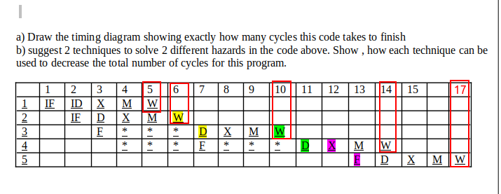
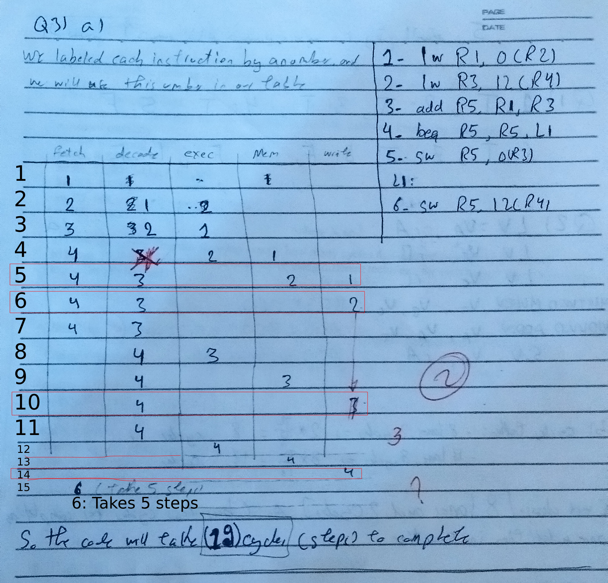

## Question (3)

According to the Answer:

Here is the ending of Instruction:
- `1` => 5
- `2` => 6
- `3` => 10
- `4` => 14
- `5` => 17

And our Answer for the instructions Endings was the same for the first 4 but we failed to get the Fifth one correct. It can be seen clear from the Image down below the ending time of the Instructions.

### Instruction 3 marked as Wrong

- Instruction 3 marked as wrong in the paper, and the Doctor puts it at `11` position. But it should be 10 as We put before.

### Staling before Decoding

- I do not know why the Answer stale `Instruction 3` before decoding. How the processor knows the Registers that will be used and data locations before decoding instruction. We made the Stale occuar when `instruction 3` goes to Decode, where the proccessor knows there is Data depency and stale it. I disagee with this point.

### Instruction 5 Not included

The dodctor did not understood this part so I will explain it here.

This is our fault actually, I just write the beginning of the Instruction without showing its execution path, as the paper was not enough, but this is not an excuse.

I will just should what I meant by `6: takes 5 steps` that was in the paper. But after all, I am satisfies with the result for it.

This is what we meaned by my the sentence.

|Step|Fetch|Decode|Exec|Mem|Write|
|:--:|:---:|:----:|:--:|:-:|:---:|
|15|6|-|-|-|-|
|16|-|6|-|-|-|
|17|-|-|6|-|-|
|18|-|-|-|6|-|
|19|-|-|-|-|6|

> Instruction 5 escaped because of Jump, so the 5th instruction is labels 6th in out Paper

We started the instruction after its prev finished writing, but after execute, which ends up having total number of steps 19 instead of 17.

